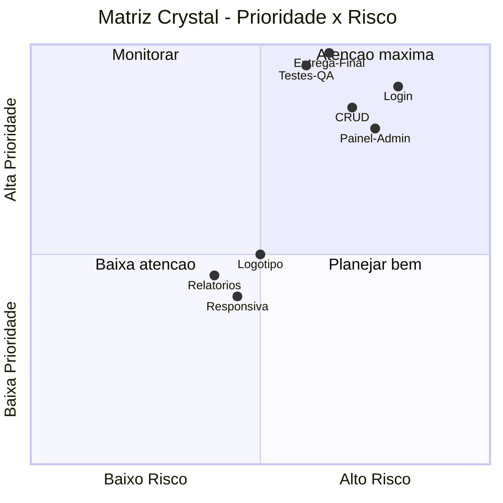

## Gráfico de Gantt

```mermaid
gantt
    title TechConnect Solutions — Cronograma 6 meses
    dateFormat  MM
    axisFormat  Mês %m

    section Planejamento
    Levantamento de requisitos - GP e Analista     :a1, 01, 1M
    Documentação funcional - Analista              :a2, 01, 2M
    Rascunhos das telas - Designer                 :a3, 01, 2M
    Layout definitivo - Designer                   :a4, 02, 2M

    section Desenvolvimento
    Config. ambiente de dev. - Devs                :b1, 02, 1M
    Criação do banco de dados - Devs               :b2, 02, 1M
    Módulo de login - Devs (E1)                    :b3, 02, 2M
    CRUD de empresas - Devs (E2)                   :b4, 03, 2M
    Upload de logotipo - Devs e Designer (E3)      :b5, 04, 1M
    Relatórios PDF/Excel - Devs (E4)               :b6, 04, 1M
    Painel administrativo - Devs e Analista (E5)   :b7, 04, 2M

    section Testes e Entrega
    Testes unitários/integração - QA               :c1, 05, 2M
    Testes de usabilidade - QA e Devs              :c2, 06, 1M
    Implantação e entrega final - GP e Devs        :c3, 06, 1M
```

## Matriz Crystal Clear

```mermaid
quadrantChart
    title Matriz Crystal - Prioridade x Risco
    x-axis Baixo Risco --> Alto Risco
    y-axis Baixa Prioridade --> Alta Prioridade
    quadrant-1 Atencao maxima
    quadrant-2 Monitorar
    quadrant-3 Baixa atencao
    quadrant-4 Planejar bem
    Login: [0.8, 0.9]
    CRUD: [0.7, 0.85]
    Painel-Admin: [0.75, 0.8]
    Testes-QA: [0.6, 0.95]
    Entrega-Final: [0.65, 0.98]
    Logotipo: [0.5, 0.5]
    Relatorios: [0.4, 0.45]
    Responsiva: [0.45, 0.4]
```
