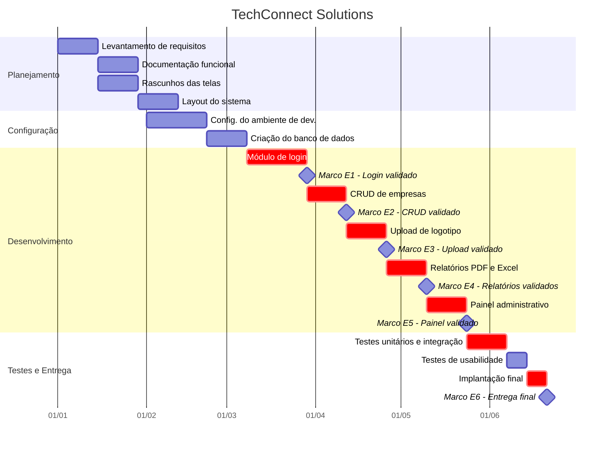
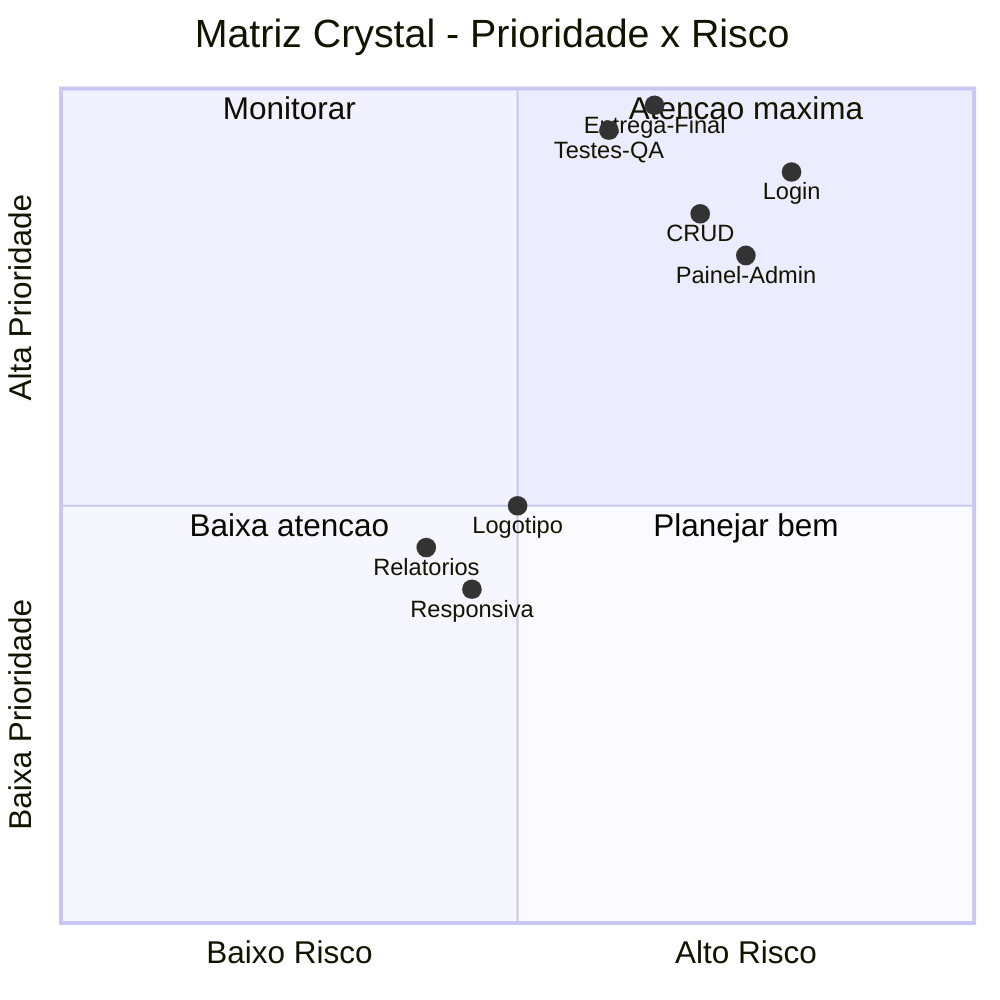

## Gráfico de Gantt

```mermaid
gantt
    title TechConnect Solutions
    dateFormat  YYYY-MM-DD
    axisFormat  %d/%m

    section Planejamento
    Levantamento de requisitos        :a1, 2025-01-01, 14d
    Documentação funcional            :a2, after a1, 14d
    Rascunhos das telas               :b1, after a1, 14d
    Layout do sistema                 :b2, after b1, 14d

    section Configuração
    Config. do ambiente de dev.       :c1, 2025-02-01, 21d
    Criação do banco de dados         :c2, after c1, 14d

    section Desenvolvimento
    Módulo de login                   :crit, d1, after c2, 21d
    Marco E1 - Login validado         :milestone, after d1, 0d
    CRUD de empresas                  :crit, e1, after d1, 14d
    Marco E2 - CRUD validado          :milestone, after e1, 0d
    Upload de logotipo                :crit, f1, after e1, 14d
    Marco E3 - Upload validado        :milestone, after f1, 0d
    Relatórios PDF e Excel            :crit, g1, after f1, 14d
    Marco E4 - Relatórios validados   :milestone, after g1, 0d
    Painel administrativo             :crit, h1, after g1, 14d
    Marco E5 - Painel validado        :milestone, after h1, 0d

    section Testes e Entrega
    Testes unitários e integração     :crit, i1, after h1, 14d
    Testes de usabilidade             :i2, after i1, 7d
    Implantação final                 :crit, j1, after i2, 7d
    Marco E6 - Entrega final          :milestone, after j1, 0d
```

---

## Situações de Atenção

```mermaid
quadrantChart
    title Matriz Crystal - Prioridade x Risco
    x-axis Baixo Risco --> Alto Risco
    y-axis Baixa Prioridade --> Alta Prioridade
    quadrant-1 Atencao maxima
    quadrant-2 Monitorar
    quadrant-3 Baixa atencao
    quadrant-4 Planejar bem
    Login: [0.8, 0.9]
    CRUD: [0.7, 0.85]
    Painel-Admin: [0.75, 0.8]
    Testes-QA: [0.6, 0.95]
    Entrega-Final: [0.65, 0.98]
    Logotipo: [0.5, 0.5]
    Relatorios: [0.4, 0.45]
    Responsiva: [0.45, 0.4]
```
